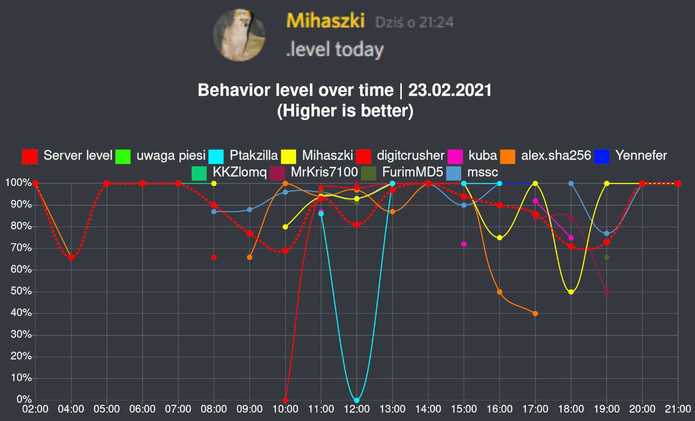
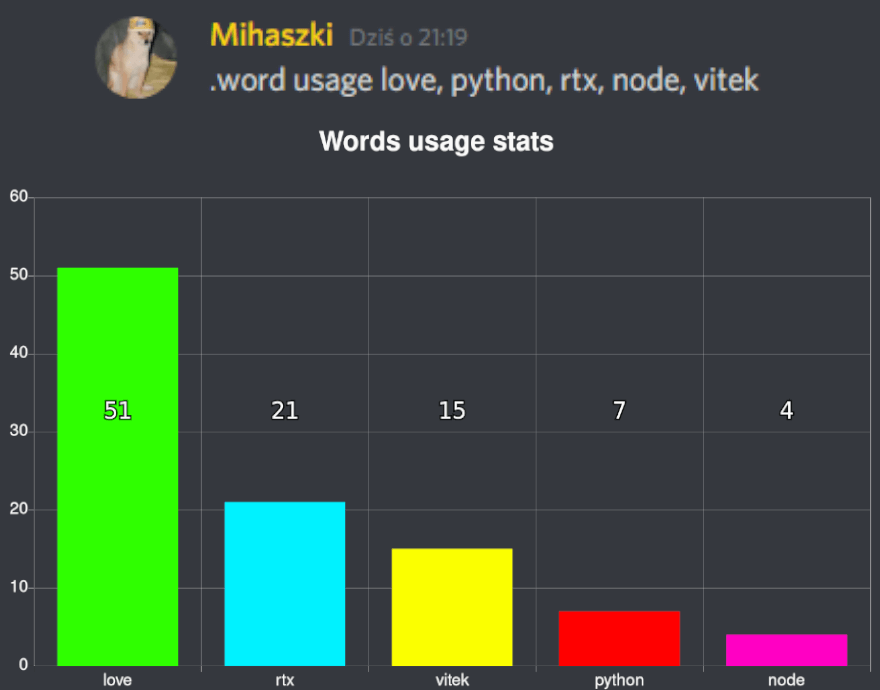
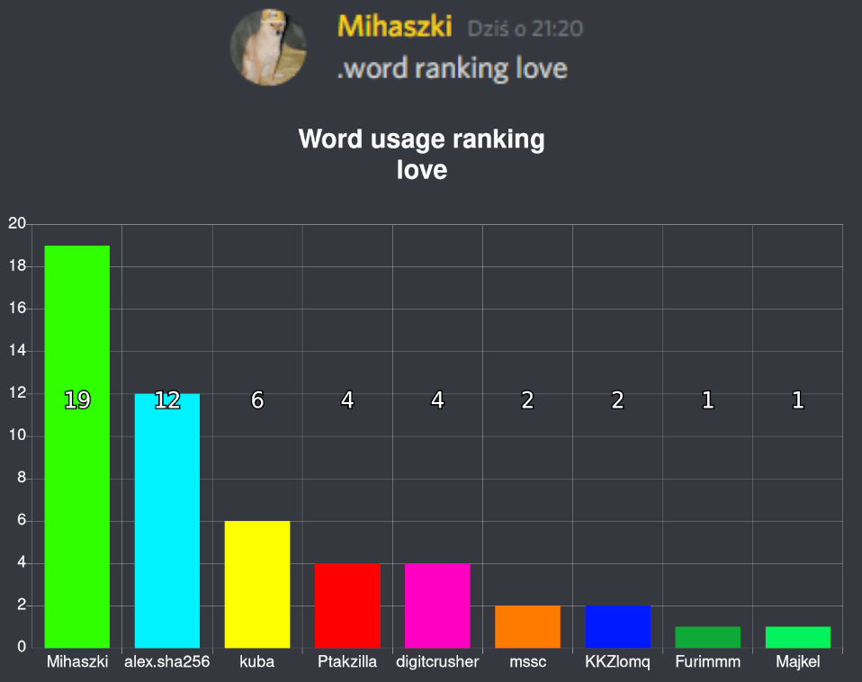

# Vitek
Vitek is a discord bot created for entertainment and statistical purposes. It uses Node.js, Discord.js library and MongoDB.
[Invite Link](https://discord.com/oauth2/authorize?client_id=670248278130163722&scope=bot+applications.commands&permissions=1544027328)

## Main features

### "Behavior" level
The bot can analyse profanities in your messages and generate "levels". The less profanity you use, the higher level you have.


### Word usage stats and word usage between users



### Reputation system stored in a database


### Message logs stored in a database


### GIF animation generation


### Image generation


## Setup
* Install node packages with `npm install`
* Create a `.env` file like this:
```
BOT_TOKEN=Your_bot_token
MONGODB=mongodb://localhost:27017/your_database
```
* Run it with `node index.js`